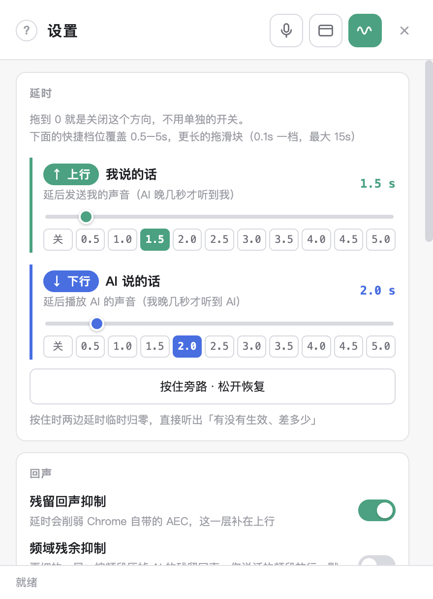
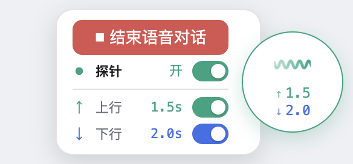
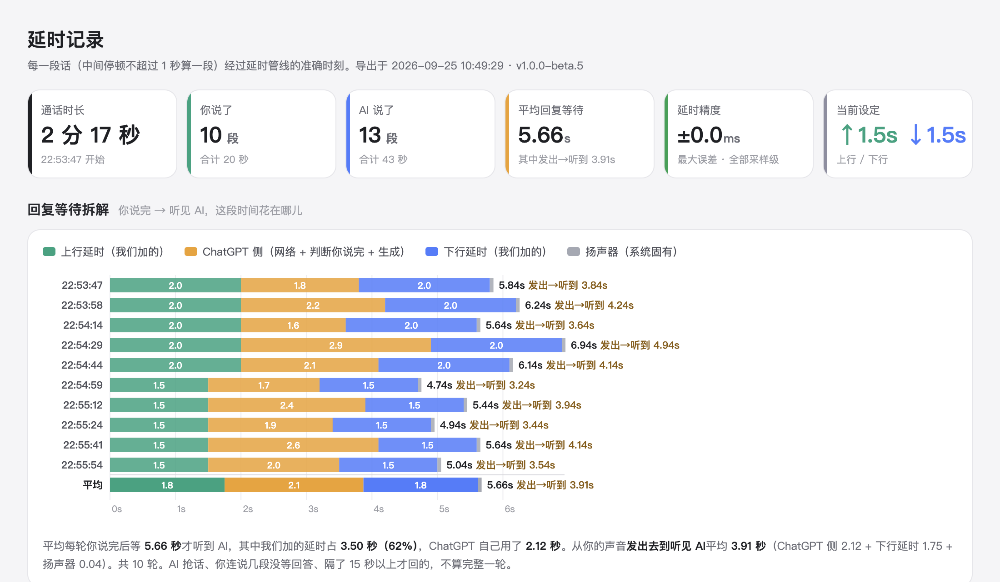

# 美超 · 慢半拍

给 ChatGPT 的语音通话**加可调的延时**：让 AI 的声音晚几秒播出来，或者让你说的话晚几秒发出去。两个方向互不影响，**加了延时也不会有回声**，每一段话延了多久还能精确记录、导出成图表和 Excel。

Windows / macOS 桌面应用 · 当前版本 **1.0.0-beta.5**（测试版）

---

## ⬇️ 下载

| 你的电脑 | 下载（永远是最新版） |
| --- | --- |
| **Windows 10 / 11**（64 位） | [**MeiChao-ManBanPai-Setup.exe**](https://github.com/longquanbaofa/electron-manbanpai/releases/latest/download/MeiChao-ManBanPai-Setup.exe) |
| **Mac**（M1 / M2 / M3 / M4 芯片） | [**MeiChao-ManBanPai-arm64.dmg**](https://github.com/longquanbaofa/electron-manbanpai/releases/latest/download/MeiChao-ManBanPai-arm64.dmg) |

Windows：双击 exe 一路下一步。Mac：打开 dmg，把应用拖进「应用程序」。历史版本见 [Releases](https://github.com/longquanbaofa/electron-manbanpai/releases)。

---

## ✨ 能做什么

- **两个方向独立加延时**：↑ 上行（你说的话）/ ↓ 下行（AI 说的话），0 ~ 15 秒，改了立刻生效，不用重新通话
- **不会有回声**：浏览器自带的回声消除照常工作，另外还有两层残余回声抑制可选
- **一键开始 / 结束语音对话**：设置页顶栏和悬浮球上都有按钮，不用回网页里点
- **悬浮球**：一直浮在屏幕最前面，通话中随时调延时、随时结束对话
- **延时记录**：自动记下每段话的准确时刻，精度不到 1 毫秒；看图表，导出 Excel
- **Google 账号也能登**：从本机 Chrome 一键导入登录状态
- **指定麦克风 / 扬声器**：通话中也能切换，不断线
- **全局快捷键**：窗口藏起来也能开关延时

---

## 📸 看一眼

<table>
  <tr>
    <td width="52%" valign="top"> <b>设置页</b>：顶栏三个按钮（语音对话 / ChatGPT 窗口 / 探针），上行绿、下行蓝，快捷档位一点到位</td>
    <td width="48%" valign="top"> <b>悬浮球</b>：鼠标移上去展开 —— 结束语音对话、探针开关、上下行快捷开关</td>
  </tr>
</table>

<b>延时记录</b>（示例数据）：你说完到听见 AI 的每一轮等待，拆成「我们加的延时」和「ChatGPT 自己用的时间」

---

## 🚀 快速上手

### 1. 第一次打开会被系统拦一下（正常现象）

没有购买代码签名证书，所以第一次打开会被拦截，**这不是病毒**：

- **Windows**：「Windows 已保护你的电脑」→ 点 **更多信息** → **仍要运行**
- **macOS**：「无法验证开发者」→ **系统设置 → 隐私与安全性** → 往下找到提示 → **仍要打开**

### 2. 登录 ChatGPT

打开后就是一个 ChatGPT 窗口，**只需登录一次**。

- **邮箱密码 / 微软 / 苹果**：直接在窗口里登。
- **谷歌账号**：谷歌不允许在这类内嵌窗口里登录（点了只会看到「此浏览器或应用可能不安全」），所以请**导入浏览器里的登录状态**：
  1. 在平时用的 **Chrome** 里登好 chatgpt.com，然后**完全关掉 Chrome**
  2. 本应用里按 `⌘,`（Windows `Ctrl+,`）打开设置，最下面「登录」里点 **⚡ 从 Chrome 导入**
  3. 页面自动刷新成已登录。绿色版 / 便携版 Chrome 扫不到时，点「📁 选目录」选它的 `User Data` 文件夹

### 3. 开始用

1. 按 `⌘,` / `Ctrl+,` 打开设置，点顶栏的 **🎙 话筒按钮**开始语音对话
2. 确认顶栏最右边的**探针按钮是绿色**（进入通话时会自动打开）
3. 在「延时」里给 **↑ 上行** 或 **↓ 下行** 选一个秒数

关掉设置窗会变成悬浮球，通话照常进行。

---

## 📖 功能说明

### 设置页顶栏

三个按钮固定在最上面，**颜色就是状态**，鼠标放上去有说明：

| 按钮 | 作用 |
| --- | --- |
| 🎙 **语音对话** | 白色 = 点击开始；**红色停止键** = 通话中，点击结束。变灰 = 页面上没有语音按钮（没登录或不在对话页） |
| ▭ **ChatGPT 窗口** | 点击藏起 ChatGPT 窗口，只留设置和悬浮球，**通话在后台继续**；藏起后变黄色虚线框，再点显示 |
| 〜 **探针** | **绿色** = 开着，正在加延时；白色 = 关着，完全不介入通话 |

### 延时

| | |
| --- | --- |
| **↑ 上行 · 我说的话**（绿色，上面） | 延后发送你的声音 —— AI 晚几秒才听到你 |
| **↓ 下行 · AI 说的话**（蓝色，下面） | 延后播放 AI 的声音 —— 你晚几秒才听到 AI |
| 快捷档位 | 关、0.5 ~ 5.0 秒一行排开；再点一次已选中的档位 = 关掉这个方向 |
| 滑块 | 0.1 秒一档，最大 15 秒 |
| 按住旁路 | 按住时两个方向临时归零，松开恢复，直接听出差别 |

**值就是开关：0 就是关。** 上次设的值会记住，下次进通话自动恢复。

### 悬浮球

设置窗一关就出现，拖到屏幕任何位置。球面显示 ↑ / ↓ 当前延时（波形在流动 = 探针开着）；鼠标移上去展开面板：**开始 / 结束语音对话**、探针总开关、上下行快捷开关（在「0」和「上次的值」之间切）。点一下球打开设置。

### 延时记录（图表 + Excel）

通话中**自动记录**每一段话（中间停顿不超过 1 秒算一段）的 4 个时刻：

- **↑ 上行**：麦克风采集到你的声音 → 交给 ChatGPT 发送
- **↓ 下行**：AI 的声音到达本机 → 从扬声器播放

短于 0.3 秒的杂音（敲键盘、呼吸）和开始通话那一下的提示音不计。设置页「延时记录」里点 **📊 查看图表**，在应用里打开，通话中实时刷新：

- **回复等待拆解**：你说完到听见 AI 的每一轮 = 上行延时 + ChatGPT 侧（网络 + 判断你说完 + 生成）+ 下行延时 + 扬声器；每轮还标出「**发出→听到**」
- **时间线**：每段话在四个时刻上的位置
- **延时稳定性**：设定值和每段实测，点落在线上就是准

点 **导出** → 「下载 / 美超慢半拍-延时记录」里存一份图表 + 一份 **Excel**（概览 / 每段记录 / 对话轮次 / 按档位四张表，时刻精确到毫秒，可排序筛选）。

### 回声

- **残留回声抑制**（默认开）：AI 在说、你没说时压低上行，压掉漏进麦克风的残留
- **频域残余抑制**（默认关）：更细，按频段只压掉 AI 的声音、放行你的声音，你和 AI 同时说话也有效。外放、出现 AI 自问自答时可以打开试试
- 戴耳机能根治回声 —— 没有扬声器漏音就没有回声

### 音频设备

「音频设备」里指定麦克风和扬声器，不选就跟系统默认。**通话中也能切**：扬声器立刻生效，麦克风无缝切换不断线。选过的设备这次没连着（比如蓝牙耳机关了）会自动改回系统默认。已过滤虚拟声卡。

### 快捷键

| 快捷键 | 作用 |
| --- | --- |
| `⌘,` / `Ctrl+,` | 打开设置 |
| `⌘⇧D` / `Ctrl+Shift+D` | 开 / 关探针（全局，窗口藏起来也能按） |
| `⌘⇧B` / `Ctrl+Shift+B` | 旁路：延时临时归零，再按恢复（全局） |
| `⌘/` / `F1` | 使用指南（设置页左上角 `?` 也能打开） |

---

## ❓ 常见问题

**延时准吗？设 1 秒是不是就正好晚 1 秒？**
准。我们加的延时和设定值误差不到 1 毫秒（「延时记录」里每段的「测得」和「设定」可以对照）。你耳朵听到的还会多出约 40 ~ 50 毫秒 —— 那是声卡到喇叭的系统固有延迟，不开本应用也一样有。

**切了延时听不出区别？**
AI 的声音是 **↓ 下行**（蓝色，下面那行）。在 AI **说话的时候**来回点下行的「关」和「5.0」，差别非常明显。切上行时 AI 说话不会变 —— 上行管的是你发出去的声音。

**为什么上行和下行的段数不一样？**
本来就不会一样：你连说几句 AI 才回一次、AI 分段回答、你插话，都会让两边不同。能一一对上的是图表里的「对话轮次」。

**有回声 / AI 自己回答自己？**
戴耳机最彻底；外放的话确认「残留回声抑制」开着，再试试打开「频域残余抑制」。

**语音按钮是灰的？**
ChatGPT 页面上没有语音按钮：没登录，或者不在对话页。回到对话页再试。

**声音没从耳机出来？**
看「音频设备」里选的是不是这个耳机；蓝牙耳机没连上时会自动改回系统默认，连上后重新选一下。

**数据会传到别处吗？**
不会。登录导入只在你电脑本地读取 Chrome 的数据；延时记录和日志都只存在本机。

**出问题了怎么反馈？**
设置页 → **诊断** → **日志文件**，把打开的那个文件发回来。

---

## 📝 更新记录

### 1.0.0-beta.5

- **新增 延时记录**：自动记录每段话的 4 个时刻，采样级精度；应用内图表（回复等待拆解 / 时间线 / 延时稳定性），导出 Excel
- **新增 开始 / 结束语音对话按钮**：设置页顶栏和悬浮球上都有
- **设置页改版**：顶栏固定三个图标按钮（颜色即状态、悬停有说明）；上行绿 / 下行蓝；快捷档位一行排开；登录挪到最下面
- **新增 频域残余抑制开关**（默认关）
- 选过的音频设备没连着时自动改回系统默认
- 修复：通话结束后仍显示「通话中」，导致第二通电话不会自动启用探针
- 适配 ChatGPT 新的网页安全策略，精确测量恢复正常

### 1.0.0-beta.4

- 从本机 Chrome 导入登录（支持谷歌账号）
- 选择麦克风 / 扬声器，通话中可切换
- 悬浮球不再闪动；设置窗只压在 ChatGPT 窗口上，不挡别的应用

> 测试阶段，发现任何问题都欢迎反馈。
