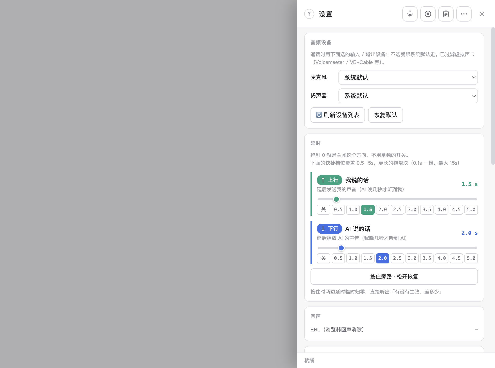
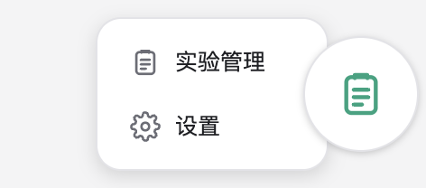
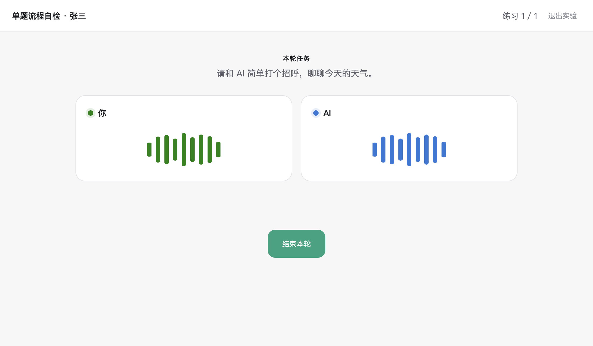
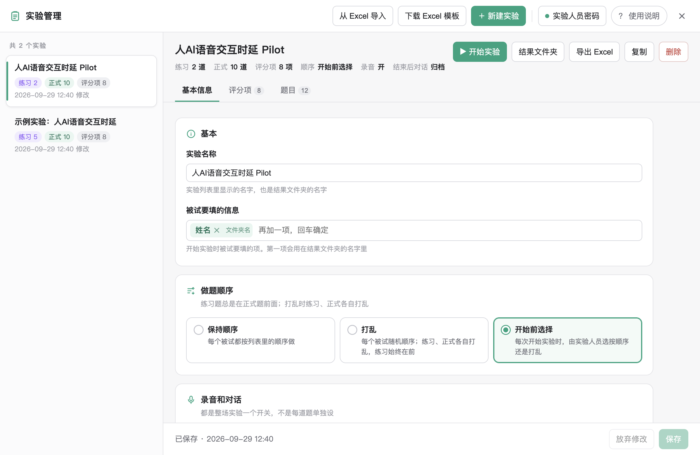
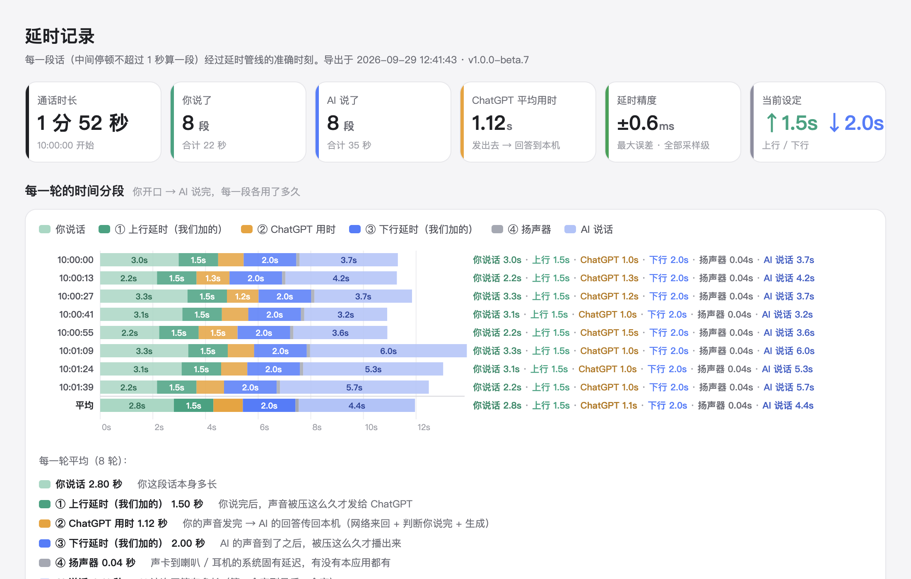
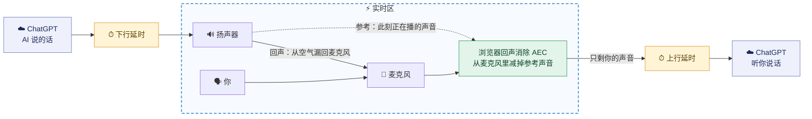
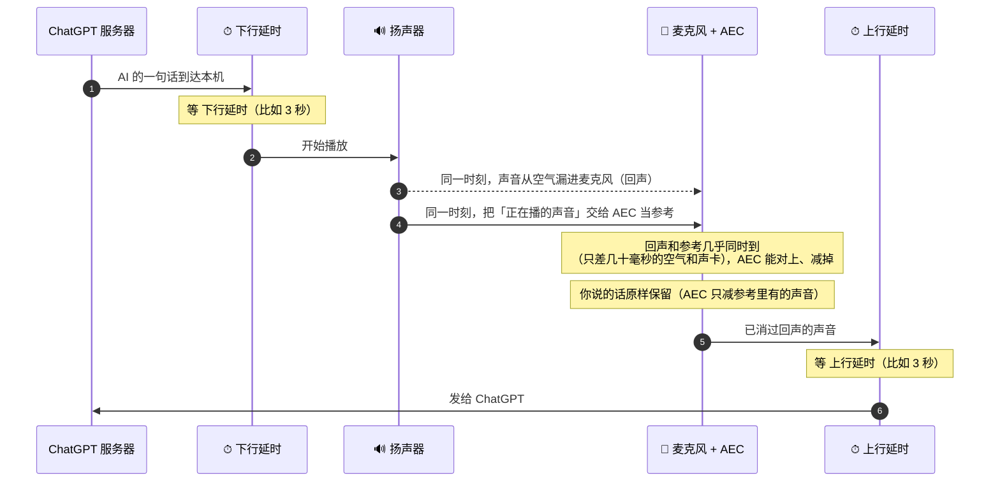
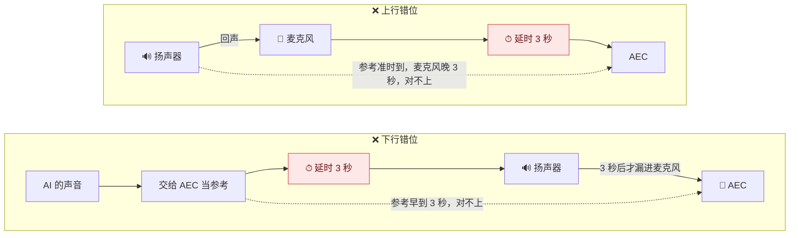

# 美超 · 慢半拍

给 ChatGPT 的语音通话**加可调的延时**：让 AI 的声音晚几秒播出来，或者让你说的话晚几秒发出去。两个方向互不影响，**加了延时也不会有回声**，每一段话延了多久还能精确记录、导出成图表和 Excel。

Windows / macOS 桌面应用 · 当前版本 **1.0.0-beta.7**（测试版）

---

## ⬇️ 下载

| 你的电脑 | 下载（永远是最新版） |
| --- | --- |
| **Windows 10 / 11**（64 位） | [**MeiChao-ManBanPai-Setup.exe**](https://github.com/longquanbaofa/electron-manbanpai/releases/latest/download/MeiChao-ManBanPai-Setup.exe) |
| **Mac**（M1 / M2 / M3 / M4 芯片） | [**MeiChao-ManBanPai-arm64.dmg**](https://github.com/longquanbaofa/electron-manbanpai/releases/latest/download/MeiChao-ManBanPai-arm64.dmg) |

Windows：双击 exe 一路下一步。Mac：打开 dmg，把应用拖进「应用程序」。历史版本都留着，见 [Releases](https://github.com/longquanbaofa/electron-manbanpai/releases)（每个版本页面上写着那一版改了什么）。

---

## ✨ 能做什么

- **两个方向独立加延时**：↑ 上行（你说的话）/ ↓ 下行（AI 说的话），0 ~ 15 秒，改了立刻生效，不用重新通话
- **不会有回声**：延时插在特定位置，浏览器自带的回声消除照常工作（[原理见下文](#-回声是怎么消掉的)）
- **一键开始 / 结束语音对话**：设置页顶栏的按钮，不用回网页里点
- **做实验**：建好实验（每道题一个任务、一组延时、几个评分项），被试一题一题做，每题自动开新对话、按题设好延时，分数存成 Excel
- **延时记录**：自动记下每段话的准确时刻，精度不到 1 毫秒；看图表，导出 Excel
- **全程录音**：每通电话录延时前、延时后两份，左声道你、右声道 AI
- **Google 账号也能登**：从本机 Chrome 一键导入登录状态
- **指定麦克风 / 扬声器**：通话中也能切换，不断线
- **全局快捷键**：一键临时去掉延时，直接听出差别

---

## 📸 看一眼

<table>
  <tr>
    <td width="45%" valign="top"> <b>设置</b>：ChatGPT 窗口右边的抽屉，边调边看对话。顶栏三个按钮（语音对话 / 全程录音 / 实验），上行绿、下行蓝，快捷档位一点到位</td>
    <td width="55%" valign="top"> <b>悬浮球</b>：在 ChatGPT 窗口右下角，鼠标移上去展开 —— 实验管理、设置  
       <b>做实验</b>（被试看到的）：任务、「可以开始说话了」、评分，看不到延时</td>
  </tr>
</table>

<b>实验管理</b>：建实验、改实验、开始实验；右上角「实验人员密码」

<b>延时记录</b>（示例数据）：你说完到听见 AI 的每一轮等待，拆成「我们加的延时」和「ChatGPT 自己用的时间」

---

## 🚀 快速上手

### 1. 第一次打开会被系统拦一下（正常现象）

没有购买代码签名证书，所以第一次打开会被拦截，**这不是病毒**：

- **Windows**：「Windows 已保护你的电脑」→ 点 **更多信息** → **仍要运行**
- **macOS**：「无法验证开发者」→ **系统设置 → 隐私与安全性** → 往下找到提示 → **仍要打开**

### 2. 登录 ChatGPT

打开后就是一个 ChatGPT 窗口，**只需登录一次**。

- **邮箱密码 / 微软 / 苹果**：直接在窗口里登。
- **谷歌账号**：谷歌不允许在这类内嵌窗口里登录（点了只会看到「此浏览器或应用可能不安全」），所以请**导入浏览器里的登录状态**：
  1. 在平时用的 **Chrome** 里登好 chatgpt.com，然后**完全关掉 Chrome**
  2. 本应用里按 `⌘,`（Windows `Ctrl+,`）打开设置，最下面「登录」里点 **⚡ 从 Chrome 导入**
  3. 页面自动刷新成已登录。绿色版 / 便携版 Chrome 扫不到时，点「📁 选目录」选它的 `User Data` 文件夹

### 3. 开始用

1. 按 `⌘,` / `Ctrl+,` 打开设置（在窗口右边拉出来），点顶栏的 **🎙 话筒按钮**开始语音对话
2. 在「延时」里给 **↑ 上行** 或 **↓ 下行** 选一个秒数

关掉设置（× 或 Esc）通话照常进行，右下角的悬浮球能随时再打开。要做实验，看下面的 [做实验](#做实验)。

---

## 📖 功能说明

### 设置页顶栏

三个按钮固定在最上面，**颜色就是状态**，鼠标放上去有说明：

| 按钮 | 作用 |
| --- | --- |
| 🎙 **语音对话** | 白色 = 点击开始；**红色停止键** = 通话中，点击结束。变灰 = 页面上没有语音按钮（没登录或不在对话页） |
| ⏺ **全程录音** | 开 / 关全程录音（默认关），见下面 [全程录音](#全程录音) |
| 📋 **实验** | 打开实验管理 |

设置、实验管理、使用指南、延时记录都在 ChatGPT 窗口里打开，不会弹出新窗口；× 或 Esc 关掉，回到下面那一层。

### 延时

| | |
| --- | --- |
| **↑ 上行 · 我说的话**（绿色，上面） | 延后发送你的声音 —— AI 晚几秒才听到你 |
| **↓ 下行 · AI 说的话**（蓝色，下面） | 延后播放 AI 的声音 —— 你晚几秒才听到 AI |
| 快捷档位 | 关、0.5 ~ 5.0 秒一行排开；再点一次已选中的档位 = 关掉这个方向 |
| 滑块 | 0.1 秒一档，最大 15 秒 |
| 按住旁路 | 按住时两个方向临时归零，松开恢复，直接听出差别 |

**值就是开关：0 就是关。** 上次设的值会记住，下次进通话自动恢复。

### 悬浮球

在 ChatGPT 窗口右下角，能拖到窗口里任何位置（可以贴着上下边）。点一下打开实验管理；鼠标移上去展开面板：**实验管理**、**设置**。窗口里开着设置、实验管理这些页面时它会藏起来。

### 延时记录（图表 + Excel）

通话中**自动记录**每一段话（中间停顿不超过 1 秒算一段）的 4 个时刻：

- **↑ 上行**：麦克风采集到你的声音 → 交给 ChatGPT 发送
- **↓ 下行**：AI 的声音到达本机 → 从扬声器播放

短于 0.3 秒的杂音（敲键盘、呼吸）和开始通话那一下的提示音不计。设置页「延时记录」里点 **📊 查看图表**，在应用里打开，通话中实时刷新：

- **每一轮的时间分段**：你开口到 AI 说完，逐段写出各用了多久 —— 你说话、上行延时、ChatGPT 用时（网络 + 判断你说完 + 生成）、下行延时、扬声器、AI 说话
- **时间线**：每段话在四个时刻上的位置
- **延时稳定性**：设定值和每段实测，点落在线上就是准

点 **导出** → 「下载 / 美超慢半拍-延时记录」里存一份图表 + 一份 **Excel**（概览 / 每段记录 / 对话轮次 / 按档位四张表，时刻精确到毫秒，可排序筛选）。

### 全程录音

默认关，设置页顶栏 ⏺ 按钮打开。每通电话录两个文件，存在「下载 / 美超慢半拍-录音」：**原始**（延时前）和**实际**（延时后，就是双方真正听到的），都是左声道你、右声道 AI。导出的延时记录 Excel 里标出了每段话在录音里的第几秒。

### 做实验

**实验管理**（设置顶栏 📋，或点悬浮球）里建实验：

- **怎么建**：「下载 Excel 模板」填好再「从 Excel 导入」；或者「＋ 新建实验」一步步来。自带一个「示例实验」（5 道练习 + 10 道正式），不用自己建就能点开始体验，不要可以删掉
- **一个实验** = 被试要填的信息（姓名等）+ 评分项（R1、R2……，比如「这段交流整体有多自然？」1~7 分）+ 题目（每道题一个任务说明、上行 / 下行延时、用哪几个评分项；分练习和正式）
- 实验能「导出 Excel」拿到别的电脑导入，内容一模一样

**开始实验**：选好实验点「▶ 开始实验」→ 被试填名字 → 开场说明 → 练习题 → 正式题 → 结束语。

- 每道题自动挂断上一题、开新的语音对话、设好这道题的延时，接通后显示「可以开始说话了」；被试**看不到延时**
- 聊完给每一项打分，点「下一题」
- 做完（或中途「退出实验」）自动挂断，延时恢复成开始前的样子
- **结果**：点实验管理里的「结果文件夹」，每位被试一个文件夹，里面的 **结果.xlsx** 一道题一行、每个评分项一列（这道题没有的评分项写「--」，有但没打分的空着），另有每个评分项的平均分和被试信息。分数不给被试看

**实验人员密码**（实验管理右上角）：设了之后，删除实验、做实验时中途退出都要输密码，被试没法随手点掉；没设的话这类操作要确认两次。第一次开始实验时会问一次要不要设。忘了密码不能直接重设：点「忘记密码」拿到请求码，发给开发人员换一个解锁码。

### 回声

不用设置，回声全靠浏览器自带的回声消除，本应用只保证延时不打乱它（[原理](#-回声是怎么消掉的)）。设置页「回声」里的 **ERL** 是它压掉了多少：AI 在说、你没说的时候，一般 55 ~ 70 dB。戴耳机能根治回声。

### 音频设备

「音频设备」里指定麦克风和扬声器，不选就跟系统默认。**通话中也能切**：扬声器立刻生效，麦克风无缝切换不断线。选过的设备这次没连着（比如蓝牙耳机关了）会自动改回系统默认。已过滤虚拟声卡。

### 快捷键

| 快捷键 | 作用 |
| --- | --- |
| `⌘,` / `Ctrl+,` | 打开设置 |
| `⌘⇧B` / `Ctrl+Shift+B` | 旁路：延时临时归零，再按恢复（全局） |
| `⌘/` / `F1` | 使用指南（设置页左上角 `?` 也能打开） |

---

## 🔇 回声是怎么消掉的

### 回声从哪来

外放时，AI 的声音从扬声器出来，又被麦克风收回去，跟着你的声音一起发回 ChatGPT。它听到「自己的话」，就可能接着回答自己（自问自答），或者以为你在插话而停下来。

### 浏览器的回声消除（AEC）怎么工作

浏览器知道**此刻扬声器在放什么**，这叫「参考」。它一边听麦克风，一边学出「这段声音经过房间传到麦克风会变成什么样」，再从麦克风信号里减掉预测出的回声，只留下你的声音。ChatGPT 网页本来就靠它消回声。

它有一个前提：**参考和回声在时间上要对得上**。扬声器到麦克风之间本来就差几十毫秒（空气 + 声卡），这点它能自己对齐，差出几秒就对不上了。

### 关键：延时只能放在「实时区」外面

从扬声器出声，到麦克风收音，再到 AEC 减掉回声，这一圈必须是实时的。本应用把两个方向的延时都放在圈外：

```mermaid
flowchart LR
    S1["☁️ ChatGPT<br/>AI 说的话"] --> DD["⏱ 下行延时"]
    DD --> SP

    subgraph RT["⚡ 实时区"]
        direction LR
        SP["🔊 扬声器"]
        YOU["🗣 你"]
        MIC["🎤 麦克风"]
        AEC["浏览器回声消除 AEC<br/>从麦克风里减掉参考声音"]
        SP -->|"回声：从空气漏回麦克风"| MIC
        YOU --> MIC
        MIC --> AEC
        SP -.->|"参考：此刻正在播的声音"| AEC
    end

    AEC -->|"只剩你的声音"| DU["⏱ 上行延时"]
    DU --> S2["☁️ ChatGPT<br/>听你说话"]

    classDef delay fill:#fff4d6,stroke:#d99a2b,color:#5a3d00
    classDef aec fill:#e3f4ea,stroke:#2f9e5b,color:#0d4424
    classDef cloud fill:#eef1fb,stroke:#6b7bb8,color:#1d2a5c
    class DD,DU delay
    class AEC aec
    class S1,S2 cloud
    style RT fill:#f7fbff,stroke:#4a90d9,stroke-width:2px,stroke-dasharray:6 4
```

- **↓ 下行延时放在扬声器之前**：AI 的声音先在网页里延时，再交给扬声器。浏览器拿去当参考的，就是**延时之后、真正在播的**那份声音，所以参考和回声还是同时到。
- **↑ 上行延时放在 AEC 之后**：麦克风的声音先实时消完回声，再延时发出去。AEC 看到的麦克风信号一点没被拖慢。

一句 AI 的话走完一圈，时间上是这样：

```mermaid
sequenceDiagram
    autonumber
    participant S as ChatGPT 服务器
    participant DD as ⏱ 下行延时
    participant SP as 🔊 扬声器
    participant AEC as 🎤 麦克风 + AEC
    participant DU as ⏱ 上行延时

    S->>DD: AI 的一句话到达本机
    Note over DD: 等 下行延时（比如 3 秒）
    DD->>SP: 开始播放
    SP-->>AEC: 同一时刻，声音从空气漏进麦克风（回声）
    SP->>AEC: 同一时刻，把「正在播的声音」交给 AEC 当参考
    Note over AEC: 回声和参考几乎同时到<br/>（只差几十毫秒的空气和声卡），AEC 能对上、减掉
    Note over AEC: 你说的话原样保留（AEC 只减参考里有的声音）
    AEC->>DU: 已消过回声的声音
    Note over DU: 等 上行延时（比如 3 秒）
    DU->>S: 发给 ChatGPT
```

不管延时设多少，第 3、4 步都是同时发生的，所以 AEC 的效果不受延时影响。

### 为什么别的做法会有回声

用虚拟声卡、系统音频工具等**浏览器外面的办法**加延时，延时就落进了实时区：

```mermaid
flowchart LR
    subgraph W1["❌ 下行错位"]
        direction LR
        A1["AI 的声音"] --> R1["交给 AEC 当参考"]
        R1 --> X1["⏱ 延时 3 秒"] --> P1["🔊 扬声器"]
        P1 -->|"3 秒后才漏进麦克风"| M1["🎤 AEC"]
        R1 -.->|"参考早到 3 秒，对不上"| M1
    end
    subgraph W2["❌ 上行错位"]
        direction LR
        P2["🔊 扬声器"] -->|回声| M2["🎤 麦克风"]
        M2 --> X2["⏱ 延时 3 秒"] --> A2["AEC"]
        P2 -.->|"参考准时到，麦克风晚 3 秒，对不上"| A2
    end
    classDef bad fill:#fde8e8,stroke:#d64545,color:#6b1111
    class X1,X2 bad
```

- **下行**：浏览器以为声音已经播出去了，拿它当参考，实际上过 3 秒才从扬声器出来，参考和回声差 3 秒。
- **上行**：麦克风的声音被拖慢 3 秒才到 AEC，参考却是准时的，也差 3 秒。

这两种情况，AEC 都对不上，回声就消不掉了。

还有一个坑：想让 AI 的声音走延时，最直接的做法是把网页播放器的声音源换掉，但这样浏览器会**停止解码 AI 的声音**，结果完全没声。本应用保留网页原来的播放器（静音，只为让浏览器继续解码），另外接出一路声音来延时和播放。

### 实测效果

2026-09 在 Windows 笔记本上外放测试（内置麦克风阵列，上下行延时各试过 1 秒和 3 秒，每次通话多轮对话，包括插话）：

| 指标 | 结果 |
| --- | --- |
| AI 在说、你没说时，回声被压掉多少 | **57 ~ 73 dB**（60 dB 相当于音量降到千分之一） |
| 压完剩下的回声 | 低于麦克风底噪，比你正常说话小 45 dB 以上 |
| 自问自答 | 没有出现 |
| 插话打断 | 正常：你的声音（延时后）一到，AI 在 1 秒左右内停下 |
| 通话中切换延时 | 回声消除不受影响，不用重新适应 |

早期版本在浏览器回声消除之后还叠了两层自己做的残余回声抑制。实测证明不需要，而且其中一层会在你插话时吃掉开头几个字，所以现在默认关闭，界面上也不再提供开关。

### 还需要注意

- **戴耳机最彻底**：没有扬声器漏音，就没有回声。
- 回声消除只在「浏览器知道在放什么」时有效。电脑上别的程序的声音（音乐、视频）它不知道，会原样进麦克风。
- 音箱开得很响、紧贴麦克风时，效果会变差。ERL 读数能看出来。

---

## ❓ 常见问题

**延时准吗？设 1 秒是不是就正好晚 1 秒？**
准。我们加的延时和设定值误差不到 1 毫秒（「延时记录」里每段的「测得」和「设定」可以对照）。你耳朵听到的还会多出约 40 ~ 50 毫秒 —— 那是声卡到喇叭的系统固有延迟，不开本应用也一样有。

**切了延时听不出区别？**
AI 的声音是 **↓ 下行**（蓝色，下面那行）。在 AI **说话的时候**来回点下行的「关」和「5.0」，差别非常明显。切上行时 AI 说话不会变 —— 上行管的是你发出去的声音。

**为什么上行和下行的段数不一样？**
本来就不会一样：你连说几句 AI 才回一次、AI 分段回答、你插话，都会让两边不同。能一一对上的是图表里的「对话轮次」。

**有回声 / AI 自己回答自己？**
戴耳机最彻底。外放的话，AI 在说、你没说的时候看一眼设置页「回声」里的 ERL：低于 40 dB 说明回声消除没压住（音箱太响、离麦克风太近），把日志文件发回来。

**语音按钮是灰的？**
ChatGPT 页面上没有语音按钮：没登录，或者不在对话页。回到对话页再试。

**声音没从耳机出来？**
看「音频设备」里选的是不是这个耳机；蓝牙耳机没连上时会自动改回系统默认，连上后重新选一下。

**实验结果存在哪？**
应用自己的数据文件夹里（不在「下载」，免得误删）。在实验管理里点「结果文件夹」直接打开。

**数据会传到别处吗？**
不会。登录导入只在你电脑本地读取 Chrome 的数据；延时记录、录音、实验结果和日志都只存在本机。

**出问题了怎么反馈？**
设置页 → **诊断** → **日志文件**，把打开的那个文件发回来。

---

## 📝 更新记录

### 1.0.0-beta.7

- **新增 实验管理**：建实验、改实验。可以下载 Excel 模板填好导入，也可以在应用里一步步新建；每道题设上行 / 下行延时、用哪些评分项，多道题能一起改；实验能导出成 Excel 拿到别的电脑导入
- **新增 做实验**：选好实验点「▶ 开始实验」→ 被试填名字 → 开场说明 → 练习题 → 正式题。每道题自动开一个新的语音对话、按这道题设好延时；结果存成 Excel（一道题一行、每个评分项一列）；做完自动挂断、把延时恢复成原来的
- **自带一个示例实验**（5 道练习 + 10 道正式），不用自己建就能体验一遍；不要可以删掉，删了不会再出现
- **新增 实验人员密码**：设了之后删除实验、做实验时中途退出要输密码，没设就要确认两次；忘记密码可以找开发人员用「请求码」换「解锁码」重设
- 「评分问题」改叫「评分项」，编号从 Q1、Q2 改成 R1、R2（旧的 Excel 照样能导入）
- **设置、实验管理、使用指南、延时记录都在 ChatGPT 窗口里打开**，不再弹出新窗口；设置是右边的抽屉，边调边能看对话
- 悬浮球放进了窗口里，能拖到紧贴上下边
- 全新的确认 / 提示弹窗样式，删除这类操作写清楚会删什么、会留什么
- 探针一直开着，去掉了开关
- 回声只靠浏览器自带的回声消除，去掉了「残留回声抑制」「频域残余抑制」两个开关

### 1.0.0-beta.6

- **新增 全程录音**（默认关）：每通电话录两份——延时前的「原始」和延时后的「实际」，左声道是你、右声道是 AI；导出的 Excel 里标出每段话在录音里的位置
- 延时记录图表：每一轮逐段写时长，并加上「你说话」「AI 说话」各多长
- 修复：延时设成 0 时漏记整段话；AI 抢先开口被误判成「配错」；很小的杂音被算成一段话
- 日志里记下 ChatGPT 网页接口失败的请求，排查登录 / 被拒更方便

### 1.0.0-beta.5

- **新增 延时记录**：自动记录每段话的 4 个时刻，采样级精度；应用内图表（回复等待拆解 / 时间线 / 延时稳定性），导出 Excel
- **新增 开始 / 结束语音对话按钮**：设置页顶栏和悬浮球上都有
- **设置页改版**：顶栏固定三个图标按钮（颜色即状态、悬停有说明）；上行绿 / 下行蓝；快捷档位一行排开；登录挪到最下面
- **新增 频域残余抑制开关**（默认关）
- 选过的音频设备没连着时自动改回系统默认
- 修复：通话结束后仍显示「通话中」，导致第二通电话不会自动启用探针
- 适配 ChatGPT 新的网页安全策略，精确测量恢复正常

### 1.0.0-beta.4

- 从本机 Chrome 导入登录（支持谷歌账号）
- 选择麦克风 / 扬声器，通话中可切换
- 悬浮球不再闪动；设置窗只压在 ChatGPT 窗口上，不挡别的应用

> 测试阶段，发现任何问题都欢迎反馈。
